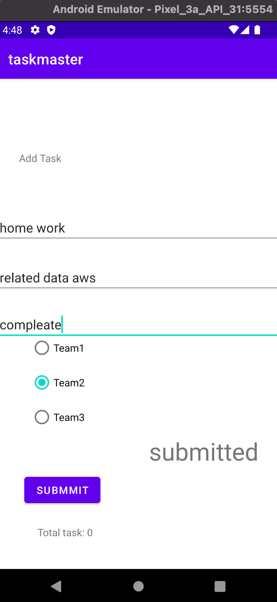

# taskmaster

## android App

## Language -- Java --

## class 
* "Taska" as a model.

* "TasksAdapter"
* AppDatabase

## AWS Cloud

* Amplify

* GraphQL

## Activity

* MainActivity

* AddTask

* AllTask

* SettingPage

* TaskDetailPage

## Method

* addTaskActivity

will return you to AddTask Activity

* allTaskActivity

will return you to AllTask Activity

* openTaskDetails

will return you to TaskDetails Activity

* openSettingPage

will return you to SettingPage Activity

* shareUserName

will save username in sharedPreferences with key "userName"

* onResume

will get username from sharedPreferences then shown as toast.

* putTitle
to put the title that pass

## Work lab 26

## Work lab 27

----------------------
## lab 28 
work in RecycleView to scroll in tasks 
and target the task that user click on it then move to TaskDetailActivity with the data for this task.
 
 ## Work in screenshote

## main activity with username

## scroll

## task1 whith state "new"

## task2 whith state "assigned"

## task3 whith state "in progress"

## task4 whith state "complete"

## Work lab 29

### home page

### Scrolll & press in coffee time task

### Go to Task Detaile page display informayion about Coffee Time Task.

### Back & press in Add Task Button & write a new task & submmit it

### Back to Home page will show the new task down of the list

### press in the new task will show you the detaile of the task in Task Detail page.

## Work lab 30

**Dealing with AWS to add Amplify to use GraphQL**
* use feach data

* Create data.

* feach data after create new data and desplay it in mainActivity.

* display task info.

**Related data aws**
* Hom page

* Task Detail.

* Setting Page (Choose Team)

* Homae Page get Task For Team2.

* Task Detail.

  * Add Task to Team2.

    Homae Page After add new Task.

* Homae Page with sign in Button.

* after press in sign in will send the user to log in page.
  
    * after log in will retutn the user to main page with user name display in top of the page.
      
      * press in sign out page will log out the user and appear button to sign in
      

